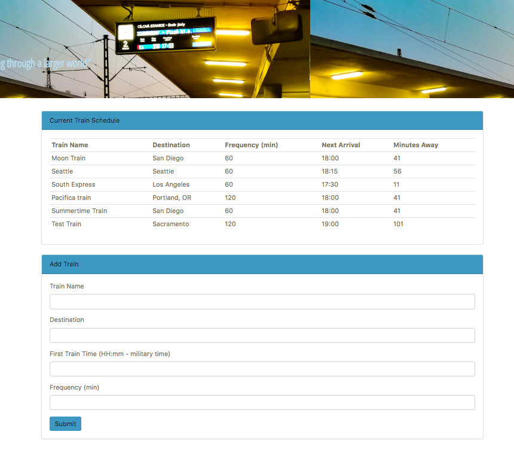

# Train-Scheduler
### by Halina Z
----------------------------------------------------------------------------------
The web app uses Firebase to write the data inserted by a user into an html form. The app retrieves the data from Firebase and dynamically generates an html table rows for each train data. The data models a train scheduler, with the various trains information such as destination, trains arrival times and how many minutes remain until they arrive at the station. To calculate arrival times and the minutes left till arrival, Moments.js library was used.

----------------------------------------------------------------------------------

Techologies used:
* HTML
* CSS
* Bootstrap 4
* Javascript
* jQuery
* Firebase
* Moments.js
----------------------------------------------------------------------------------
